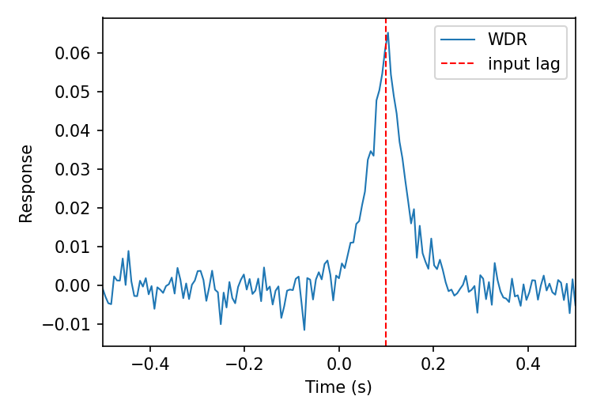

# wiener-timing

Wiener deconvolution for astronomical timing analysis. Given two light curves
(for example two X-ray energy bands, or two radio frequencies), this code
estimates the **time lag** between them and the **response function**, the
kernel that turns one light curve into the other.

the Wiener deconvolved response (WDR):

- filters out instrumental noise using a noise level set by the counting
  statistics of the data,
- gives a lag and a response width that don't depend on bin size or
  segmentation choices,
- resolves multiple lags that a cross-correlation may blend into one,
- recovers the shape of the response, which carries physical information
  about the process causing the lag.

The method is described in Kırmızıbayrak & Heyl (submitted to MNRAS).



## Installation

The code needs Python 3 with NumPy (and Matplotlib for the example):

```bash
pip install -r requirements.txt
```

Then copy `wiener_timing.py` into your project, or run your scripts from this
folder.

## Quick start

```python
import numpy as np
from wiener_timing import resample_to_grid, poisson_noise_level, wiener_response

# load two light curves: times and counts per bin
t1, c1 = np.loadtxt("band1.dat", unpack=True)
t2, c2 = np.loadtxt("band2.dat", unpack=True)

# put both on a common, evenly spaced grid
t, y1, y2 = resample_to_grid(t1, c1, t2, c2, nbins=4096)
dt = t[1] - t[0]

# noise level: total counts for Poisson noise (Eq. 11 of the paper)
eta = poisson_noise_level(y1)

lags, response = wiener_response(y1, y2, noise=eta, dt=dt, window_k=8)
```

`response` is the Wiener deconvolved response on the time axis `lags`.
A peak at **positive** lag means **band 1 lags behind band 2**. Swap the
inputs to reverse the convention.

For a full worked example that simulates two light curves with a known lag
and recovers it, run:

```bash
python example.py
```

## Choosing the noise level

The noise level `eta` sets how much of the high-frequency power is treated as
noise and filtered out.

| Noise type | Typical data | Noise level | Function |
|---|---|---|---|
| Poisson | X-ray photon counts | total counts N in band 1 | `poisson_noise_level(counts)` |
| White (Gaussian) | radio flux densities | n_bins × σ² | `white_noise_level(sigma, nbins)` |

If neither applies, plot the power spectrum of band 1 and set `eta` to the
level where it flattens at high frequencies. A higher `eta` smooths the
response more but can wash out real features.

## Practical tips

- Use a bin size well below the lag you expect to measure.
- Make sure the frequency range of the power spectrum covers the timescales
  of interest (QPOs, expected lags).
- The time resolution of the response improves with count rate
  (roughly as rate^-1/2), not so much with longer exposures given that enough variability cycles are already covered within the exposure time. 
- Check for large gaps before resampling: interpolation across a gap invents
  data and would result to false detections. 

## Citation

If you use this code, please cite the paper (see `CITATION.cff`, or the
"Cite this repository" button on GitHub).

## License

MIT, see `LICENSE`.
